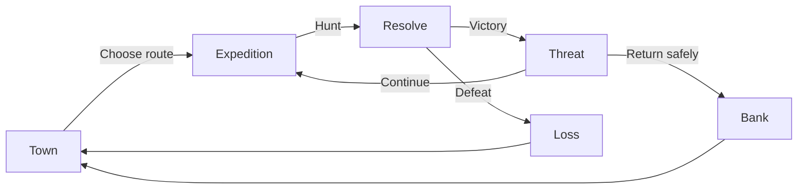

# Gameplay Feature Domain Brief

## Document Status

- Status: Proposed
- Evidence date: 2026-07-30
- Audience: Game Design Agent, implementation agents, UX Visual Agent, and Player Simulation Agent
- Runtime target: PHP 8+, server-rendered HTMX interface, session state with cookie fallback, no database
- Primary recommendation: add an expedition risk-and-return loop before adding more content volume

## 1. Purpose

This document translates a sustained player simulation into a technical gameplay roadmap. It defines the observed player problems, proposes feature options, selects a recommended first mechanic, and maps each feature to the current domain boundaries.

The goal is to deepen player agency without replacing the existing static, procedural PHP architecture.

## 2. Current Domain Model

The current loop is:

```text
Create Hero -> Hunt -> Receive Gold/XP/Loot -> Sell -> Buy/Expand -> Rest -> Repeat
```

Current ownership boundaries:

| Domain | Current owner | Responsibility |
|---|---|---|
| Hero state and action rules | `src/Game/Engine.php` | Session state, combat, rewards, time, stamina, inventory, purchases |
| Classes | `src/Data/Classes.php` | Class identity, base stats, portrait metadata |
| Monsters | `src/Data/Monsters.php` | Monster stats, rewards, loot, images |
| Equipment | `src/Data/Equipment.php` | Shop catalog, slots, prices, stat bonuses |
| Request coordination | `src/Controller/GameController.php` | Action dispatch and view-model assembly |
| Derived presentation state | `src/Model/HeroViewModelBuilder.php` | Battle and scene projections |
| Player interface | `src/View/templates/game.php` | HTMX actions and rendered game shell |
| Theme and HTMX lifecycle | `Assets/js/app.js`, `Assets/css/app.css` | Phase theme and presentation behavior |

Architectural constraints:

- Keep state in `$_SESSION['hero']` and persist a compact fallback copy in the hero cookie.
- Keep all action responses compatible with the `#game-shell` HTMX `outerHTML` swap.
- Keep data catalogs static PHP arrays.
- Keep procedural functions unless a separate refactor is explicitly approved.
- Keep persisted state compact. Cookie payloads should target less than approximately 3.5 KB after JSON encoding.
- Store stable IDs in state instead of duplicating full catalog records.

## 3. Long-Loop Playtest Evidence

Test policy:

- Fresh Hunter at level 1.
- Four cycles.
- Each cycle: 10 Hunts, Sell, optional market investment, Rest.
- Purchases: Hunter Blade in cycle 1, Leather Coat in cycle 2, bag expansion in cycle 3.
- Total HTMX requests: 54.

Observed results:

| Metric | Start | End |
|---|---:|---:|
| Level | 1 | 7 |
| Gold | 20 | 390 |
| HP | 34/34 | 70/70 |
| Bag capacity | 20 | 25 |
| World time | Day 1 - Morning | Day 3 - Morning |
| Equipment | None | Hunter Blade + Leather Coat |

Cycle economy:

| Cycle | Start level | End level | Start gold | Gold after selling | Gold after purchases/rest |
|---|---:|---:|---:|---:|---:|
| 1 | 1 | 4 | 20 | 130 | 104 |
| 2 | 4 | 5 | 104 | 218 | 198 |
| 3 | 5 | 6 | 198 | 310 | 291 |
| 4 | 6 | 7 | 291 | 394 | 390 |

Encounter results:

| Monster | Encounters |
|---|---:|
| Goblin | 12 |
| Giant Rat | 11 |
| Skeleton | 9 |
| Slime | 8 |
| Total victories | 40 |
| Total defeats | 0 |

Player-facing conclusions:

1. The action loop is technically stable, but Hunt becomes deterministic too quickly.
2. Early progression is compressed. Ten Hunts produced three levels and enough gold for the strongest Hunter weapon in the current catalog.
3. Gold generation exceeds available sinks. The player ended with more gold after every cycle despite buying the planned upgrades.
4. The optimal policy is repetitive: Hunt ten times, Sell all, Rest, repeat.
5. The Map has no gameplay choice, and all four monsters remain in one undifferentiated pool.
6. Day phases affect presentation and timing but do not materially change player strategy.
7. Loot has only one decision: sell everything. Item names do not create mechanical differences.
8. Most classes differ by base stats only. Bard is the only class with a visible action-specific passive.

## 4. Design Goals

Any new mechanic should satisfy these goals:

- Add a decision before or during repeated Hunts.
- Preserve a fast action cadence and HTMX response model.
- Introduce controlled risk without deleting the player's entire run.
- Slow economic saturation through desirable choices, not only lower rewards.
- Make time phase, class, monsters, loot, and Map contribute to gameplay.
- Remain fully playable with session and cookie persistence.

Non-goals:

- No database, account system, multiplayer market, real-time server job, or offline timer service.
- No large object-oriented rewrite of the engine.
- No permanent character deletion or punitive full inventory loss.
- No client-authoritative game rules.

## 5. First-Mechanic Options

### Option A: Expedition Risk and Return

The player builds Threat and unbanked rewards while continuing to Hunt, then chooses when to return to town.

Advantages:

- Directly changes the repeated Hunt loop.
- Creates a visible push-your-luck decision.
- Reuses combat, inventory, location, and town actions.
- Provides a foundation for elites, bosses, routes, and contracts.

Trade-offs:

- Requires pending reward state and explicit return-to-town behavior.
- Existing Sell/Rest actions must stop acting as implicit teleports.

### Option B: Daily Contract Board

The player selects objectives such as defeating a monster type, selling a material set, or winning at Night.

Advantages:

- Small state footprint.
- Gives short-term goals and uses existing actions.
- Easy to add incrementally.

Trade-offs:

- Adds direction but does not make individual Hunts more interesting.
- Risks becoming passive checklist progression.

### Option C: Loot Crafting and Equipment Upgrades

Monster materials become recipe inputs instead of generic sell-only items.

Advantages:

- Adds inventory decisions and durable goals.
- Creates strong gold and material sinks.

Trade-offs:

- Requires more UI, catalog data, and balance work.
- Does not solve low combat risk by itself.

### Recommendation

Implement Option A first. Expedition state is the smallest foundation that changes the core loop itself. Add contracts and crafting only after the risk loop produces stable pacing data.

## 6. Feature F1: Expedition Risk and Return

Priority: P0

### Player Problem

Hunt has no commitment or exit decision. Rewards are immediately banked, town actions are always available, and combat becomes automatic after early level gains.

### Player Flow



### Proposed Rules

- Selecting Hunt outside an active expedition starts one automatically on the selected route.
- Expedition Threat starts at 0 and increases by 1 after each victory, capped at 5.
- Monster combat power increases by 8% per Threat level.
- Pending gold and XP increase by 10% per Threat level.
- The player receives pending rewards, not banked rewards, during an expedition.
- `Return to Town` banks all pending gold, XP, and loot and resets Threat.
- On partial defeat:
  - Hero returns to town at current escaped HP.
  - Lose 50% of pending gold, rounded down.
  - Lose one random pending loot item when at least one exists.
  - Keep pending XP to avoid excessive progression punishment.
- The fifth consecutive victory is an Elite encounter.
- Elite victory guarantees one route-specific material and then allows Continue or Return.
- Rest, Sell, Buy, and Expand Bag are valid only in town.
- Invalid town actions outside town return a clear log message and do not consume stamina.

### Hero State Extension

```php
'expedition' => [
    'active' => false,
    'route_id' => 'meadow',
    'threat' => 0,
    'wins' => 0,
    'pending_gold' => 0,
    'pending_xp' => 0,
    'pending_loot' => [],
],
```

Persist item IDs and integer values only. Do not persist duplicated monster or route catalog objects.

### Engine Functions

Add procedural helpers in `src/Game/Engine.php`:

```php
gameEnsureExpeditionState(array &$hero): void
gameStartExpedition(array &$hero, string $routeId): void
gameGetThreatMultiplier(array $hero): float
gameAddPendingRewards(array &$hero, array $rewards): void
gameBankExpeditionRewards(array &$hero): void
gameFailExpedition(array &$hero): void
gameReturnToTown(array &$hero): void
```

New actions:

- `select_route`
- `return_town`
- Existing `hunt` resolves against expedition state.

### UI Changes

- Add Threat `0/5` and pending reward summary near the Field Viewer.
- Replace the static Map marker with route choices when in town.
- Show `Continue Hunt` and `Return to Town` as explicit commands during an expedition.
- Hide or disable town-only controls outside town with a concise reason.
- Show Elite warning at Threat 4 before the fifth Hunt.

### Tuning Knobs

- Threat cap: 5.
- Monster power per Threat: 8%.
- Reward bonus per Threat: 10%.
- Pending gold loss on defeat: 50%.
- Pending loot loss: 1 item.
- Elite interval: 5 wins.

### Acceptance Criteria

- Five consecutive victories increase Threat from 0 to 5.
- Monster and reward calculations use the current Threat before reset.
- Return banks pending rewards exactly once.
- Repeated Return requests cannot duplicate rewards.
- Defeat applies the configured loss and returns the hero to town.
- Town-only actions outside town do not consume stamina or mutate inventory/gold.
- Existing saved heroes receive a valid default expedition state.
- JSON-encoded hero state remains below the agreed cookie budget at base bag capacity.

## 7. Feature F2: Routes, Zones, and Bosses

Priority: P1, after F1

### Player Problem

The Map is decorative and all monsters come from one random pool. Players cannot choose difficulty, target loot, or pursue a destination.

### Data Model

Create `src/Data/Locations.php`:

```php
function gameLocationDefinitions(): array
{
    return [
        'meadow' => [
            'name' => 'Crossroad Meadow',
            'unlock_level' => 1,
            'monster_ids' => ['slime', 'giant_rat'],
            'elite_id' => 'alpha_rat',
            'boss_id' => 'meadow_guardian',
            'material_id' => 'wild_essence',
        ],
        'ruins' => [
            'name' => 'Sunken Ruins',
            'unlock_level' => 4,
            'monster_ids' => ['goblin', 'skeleton'],
            'elite_id' => 'goblin_raider',
            'boss_id' => 'bone_warden',
            'material_id' => 'ruin_fragment',
        ],
    ];
}
```

Add stable `id`, `route_ids`, and optional `weight` fields to monsters in `src/Data/Monsters.php`.

### Rules

- Route unlocks at levels 1, 4, and 8 for the first balancing pass.
- Each route owns 2-3 common monsters, one Elite, and one boss.
- Boss appears after three Elite victories on that route.
- First boss victory grants a permanent route milestone, not raw stat inflation.
- Suggested milestone rewards: new shop tier, recipe, or contract slot.

### State

```php
'route_id' => 'meadow',
'route_progress' => [
    'meadow' => ['elite_wins' => 0, 'boss_defeated' => false],
],
```

### Acceptance Criteria

- Locked routes cannot be selected through crafted requests.
- Route selection changes only the eligible encounter pool.
- Boss progress persists across reload and cookie fallback.
- Defeating a boss unlocks its reward once.

## 8. Feature F3: Time-Phase Gameplay Modifiers

Priority: P1

### Player Problem

Morning, Day, Afternoon, and Night are visually distinct but do not change strategy.

### Initial Modifier Table

| Phase | Player-facing modifier | Purpose |
|---|---|---|
| Morning | +10% XP | Progression window |
| Day | +10% equipment shop discount | Spending window |
| Afternoon | +15% loot sell value | Economy window |
| Night | Monsters +15% power, pending gold +25% | Risk/reward window |

Use integer calculations with one shared rounding rule:

```php
(int) floor($baseValue * $multiplier)
```

### Technical Changes

Create `src/Data/World.php` with phase modifier definitions. Add helpers:

```php
gameGetCurrentPhase(array $hero): string
gameGetPhaseModifiers(array $hero, array $worldRules): array
gameApplyRewardModifier(int $value, float $multiplier): int
```

Expose active modifiers through `GameController` and render them beside world time. The server remains authoritative; JavaScript only animates the already-rendered phase.

### Acceptance Criteria

- Each phase applies exactly one documented modifier set.
- HTMX Rest keeps visible time, shell phase metadata, and modifier text synchronized.
- Night difficulty modifies the same combat-power calculation used by Threat.
- Phase transitions do not retroactively change pending rewards.

## 9. Feature F4: Economy and Equipment Progression

Priority: P1

### Player Problem

The strongest current Hunter weapon costs 22 gold, while the first ten-hunt cycle generated 110 net gold before purchases. Equipment is saturated almost immediately and repeat purchases of the same item remain possible.

### Proposed Rules

- Add equipment tiers: starter, adventurer, veteran.
- Suggested target prices based on observed income:
  - Starter: 30-50 gold.
  - Adventurer: 120-180 gold.
  - Veteran: 300-450 gold plus one route material.
- Add `unlock_level` and optional `material_cost` to catalog items.
- Track owned equipment IDs and separate Buy from Equip.
- Block duplicate purchases unless an upgrade system explicitly consumes duplicates.
- Add equipment upgrade levels from `+0` to `+3`.
- Upgrade cost formula:

$$
\text{cost}(n) = \text{base price} \times (n + 1)
$$

- Upgrade bonuses should add one catalog-defined stat step, not multiply all stats.

### State

```php
'owned_equipment' => ['rusty_sword'],
'equipment_upgrades' => ['rusty_sword' => 1],
'equipped' => ['weapon' => 'rusty_sword', 'armor' => null],
```

### Acceptance Criteria

- Duplicate Buy attempts fail without spending gold or stamina.
- Locked items cannot be purchased through crafted requests.
- Equip does not charge the item purchase price again.
- Upgrade costs and stat changes are deterministic and visible before confirmation.

## 10. Feature F5: Class Passives and Mastery

Priority: P1

### Player Problem

Classes primarily differ by base stats. Only Bard currently changes a named action outcome.

### Initial Passive Set

| Class | Passive | First-pass rule |
|---|---|---|
| Fencer | Tempo | Every third consecutive victory reduces the next Hunt stamina cost by 1 |
| Brawler | Grit | First defeat in each expedition loses no pending loot |
| Scholar | Analysis | Shows the next encounter family and gains +10% XP from Elite victories |
| Priest | Sanctuary | Expedition defeat preserves an additional 25% pending gold |
| Hunter | Trail Sense | Route material drop chance +15% |
| Bard | Performance | Existing +2 Rest gold; Elite return also grants +2 gold per Threat |

### Data Shape

Extend class definitions with passive metadata:

```php
'passive' => [
    'id' => 'trail_sense',
    'name' => 'Trail Sense',
    'description' => 'Route materials are more likely to drop.',
],
```

Keep passive resolution in named engine helpers rather than anonymous callables inside data arrays.

### Mastery

- Gain 1 mastery point after a successful expedition return with Threat 3 or higher.
- Cap stored mastery at 20 in the first release.
- Milestones at 5, 10, and 20 improve the passive, not base stats.

### Acceptance Criteria

- Every passive has a visible log or preview effect.
- Passive calculations are covered by one focused playtest per class.
- Missing legacy passive state defaults safely.
- Bard's existing Rest behavior remains compatible.

## 11. Feature F6: Contract Board

Priority: P2

### Player Problem

After equipment is acquired, the player lacks medium-term objectives.

### Contract Types

- Defeat a specified monster family.
- Return from an expedition at Threat 3 or higher.
- Sell a specified route material quantity.
- Win an Elite encounter during a specified phase.

### Rules

- Generate three contracts per in-game day.
- The player may activate one contract at a time.
- Generate from deterministic inputs (`day`, `class`, and contract slot) so reloads cannot reroll rewards.
- Contract rewards should prefer materials, shop unlocks, and mastery over unrestricted gold.
- Expired contracts remain claimable if completed before day rollover, then clear after claim.

### State

```php
'contracts' => [
    'day' => 4,
    'active_id' => 'night_elite',
    'items' => [
        ['id' => 'night_elite', 'progress' => 0, 'target' => 1, 'complete' => false],
    ],
],
```

Store only generated IDs and progress. Resolve display text and rewards from static definitions.

## 12. Feature F7: Loot Materials and Recipes

Priority: P2

### Player Problem

All loot differs only by name and random sell value, so Sell All is always correct.

### Proposed Model

Create `src/Data/Loot.php` with stable item IDs, source route, rarity, sell value, and recipe tags.

```php
'wild_essence' => [
    'name' => 'Wild Essence',
    'rarity' => 'uncommon',
    'sell_value' => 12,
    'tags' => ['meadow', 'upgrade'],
],
```

Add two town actions:

- `sell_item`: sell a selected quantity.
- `craft_item`: consume exact material IDs and gold.

Keep `sell` as Sell All Common Loot for quick play. It must preserve protected recipe materials.

### Acceptance Criteria

- Loot values are catalog-defined, not rerolled when acquired.
- Crafting validates all ingredients before consuming any state.
- Failed crafting is atomic and consumes nothing.
- Inventory remains within bag capacity and cookie budget.

## 13. Shared Technical Requirements

### State Migration

Every new state branch requires an idempotent ensure function. Never assume cookie or session state contains newly introduced keys.

Example:

```php
function gameEnsureExpeditionState(array &$hero): void
{
    $hero['expedition'] ??= gameNewExpeditionState();
}
```

Ensure functions must also validate types, ranges, and referenced catalog IDs.

### Action Validation

For every new action:

1. Whitelist the action in controller/engine dispatch.
2. Validate location, unlocks, resources, and submitted IDs before charging stamina or gold.
3. Mutate state once.
4. Append one concise player-facing log entry.
5. Persist state through the existing session/cookie path.
6. Return the full `#game-shell` for HTMX `outerHTML` replacement.

### Cookie Budget

Before merging a feature, test:

```php
strlen(json_encode($_SESSION['hero']))
```

Target less than 3,500 bytes for a normal active run. If state approaches the limit:

- Store IDs instead of definitions.
- Cap logs, contract history, and pending loot arrays.
- Remove derived values that can be rebuilt from static catalogs.
- Do not silently truncate inventory or progression state.

### Randomness

- Keep runtime combat randomness server-side with `random_int`.
- Use deterministic generation only where reload rerolling would be exploitable, such as daily contracts or shop rotation.
- Expose ranges in the UI when a player must compare choices.

### HTMX

- New controls use `hx-post` to the current script path.
- Target `#game-shell` with `hx-swap="outerHTML"`.
- Tab-only actions must not consume stamina or trigger game rules.
- No action may produce more than one `#game-shell`.

## 14. Delivery Order

### Milestone 1: Core Tension

- F1 Expedition Risk and Return.
- Restrict town actions by location.
- Add Threat and pending reward UI.
- Run 50-Hunt comparison against the baseline in this document.

Success target:

- At least one voluntary Return decision before forced recovery in a typical 20-Hunt sample.
- Level 1 should not reach level 4 within the first ten Hunts without deliberately accepting elevated Threat.
- A fresh class should experience a meaningful loss risk by Threat 3.

### Milestone 2: Choice and Identity

- F2 Routes, Zones, and Bosses.
- F3 Time-phase modifiers.
- F5 class passives.

Success target:

- Two routes support different loot goals.
- At least two phases change the player's chosen action in observed playtests.
- Each class has one externally visible passive effect.

### Milestone 3: Long-Term Economy

- F4 equipment tiers and ownership.
- F6 contracts.
- F7 materials and recipes.

Success target:

- The player has at least two desirable gold/material sinks after level 7.
- Repeating the same ten-Hunt policy is no longer strictly optimal.

## 15. Agent Handoff Matrix

| Agent | Primary responsibility | Required output |
|---|---|---|
| Game Design Agent | Tune F1 rules and economy targets | Final rule table, formulas, reward/loss simulations, chosen tuning values |
| Implementation agent | Add state, data, actions, and validation | Small domain-scoped patches with PHP lint evidence |
| UX Visual Agent | Threat, pending reward, route, contract, and recipe interfaces | Responsive HTMX-compatible UI using the existing visual language |
| Player Simulation Agent | Validate pacing and edge cases | Logged fresh-run, defeat, return, route, phase, class, and persistence flows |

Recommended implementation slices:

1. Add expedition state and `return_town` without reward multipliers.
2. Move Hunt rewards into pending state and validate bank/loss behavior.
3. Add Threat scaling and Elite interval.
4. Add UI summaries and location restrictions.
5. Run a 50-Hunt balance test before starting F2.

## 16. Required Playtest Matrix

| Flow | Expected evidence |
|---|---|
| Fresh expedition | Threat starts at 0 and first Hunt creates pending rewards |
| Voluntary return | All pending rewards bank once and location becomes town |
| Defeat | Configured loss applies once; no negative values |
| Elite | Fifth win selects Elite and grants route material |
| Town restriction | Sell/Rest/Buy outside town do not mutate resources |
| Time rollover | Threat and modifiers remain correct across Night to Morning |
| Bag full | Pending loot is rejected or handled by documented overflow rule |
| Cookie reload | Active expedition and pending rewards persist without duplication |
| All classes | Each passive triggers and logs exactly as specified |
| Crafted request | Locked route/item/contract IDs are rejected server-side |

## 17. Open Balance Questions

The Game Design Agent should resolve these before F1 implementation:

1. Should pending XP be fully preserved on defeat, or should a small percentage be lost?
2. Should Elite encounters be mandatory at the fifth win or optionally postponed by returning?
3. Should bag capacity count pending loot only, banked inventory only, or both?
4. Should HP persist between expedition encounters without any field healing?
5. Should Night's reward modifier stack additively or multiplicatively with Threat?
6. What first-ten-Hunt level target is desired for each class: level 2 or level 3?
7. What percentage of starting runs should reach Threat 3 before returning?

Default recommendation: preserve XP, make Elite mandatory if the player continues, count all carried loot against one bag, preserve HP, multiply modifiers in one documented order, target level 2-3 after ten Hunts, and tune for approximately 60% of new runs to attempt Threat 3.
